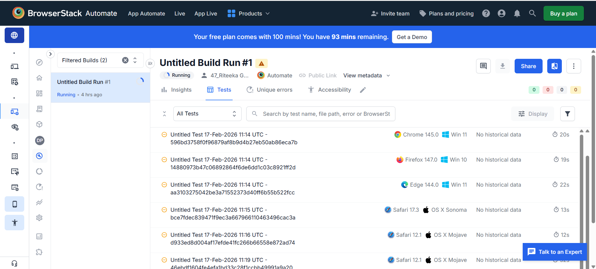
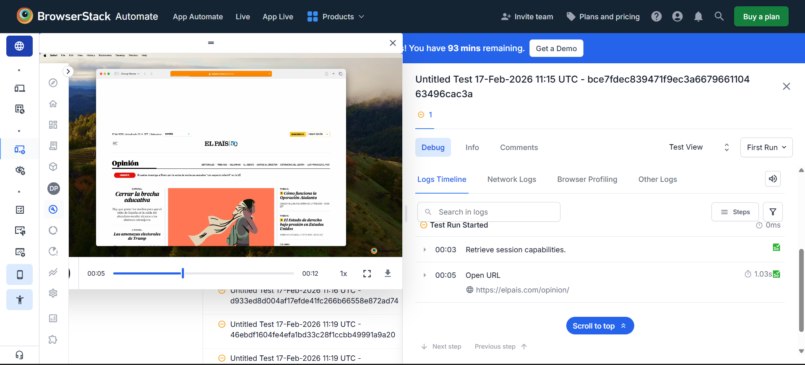
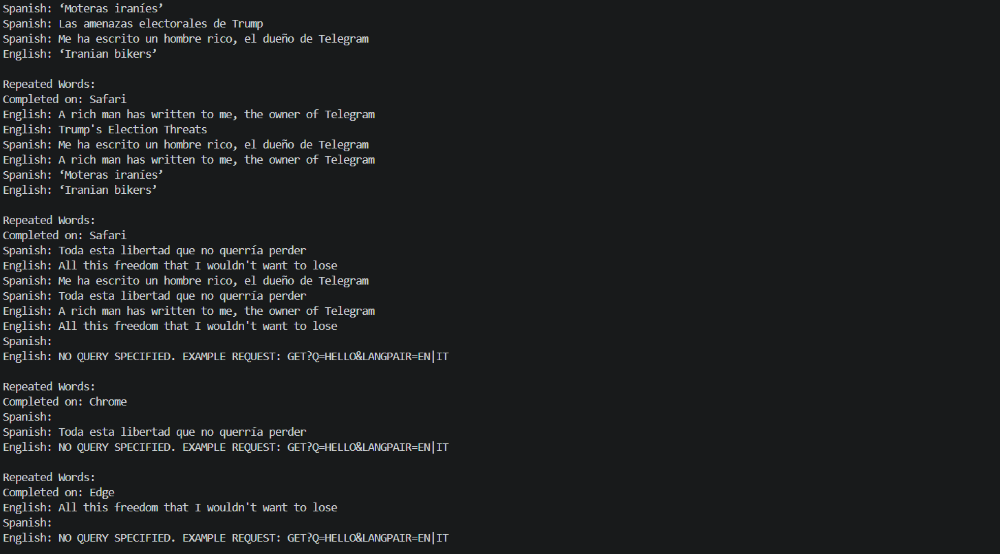

cat << 'EOF' > README.md
# 📄 BrowserStack Automation Assignment  
Automated scraping, translation, and cross-browser execution using Selenium + BrowserStack

---

## 🚀 Project Overview
This project automates the following workflow using Node.js Selenium WebDriver:

1. Open El País website
2. Navigate to the Opinion section
3. Fetch first 5 articles
4. Extract:
   - Title (Spanish)
   - Article content preview
   - Article image
5. Translate titles to English
6. Perform word frequency analysis
7. Run the same test across multiple browsers using BrowserStack

Browsers tested:
- Chrome
- Firefox
- Edge
- Safari

---

## 🧠 What This Assignment Demonstrates
- Web Automation
- DOM Handling
- Dynamic selectors handling
- API Integration (Translation)
- File handling (images download)
- Cross-browser testing
- Cloud automation using BrowserStack

---

## 🛠️ Tech Stack
- Node.js
- Selenium WebDriver
- BrowserStack Automate
- Axios
- Dotenv

---

## 📂 Project Structure
browserstack-assignment
│
├── tests/
│   ├── elpais.js
│   ├── elpaisCloud.js
│   └── runOnBrowserstack.js
│
├── utils/
│   └── translator.js
│
├── images/
├── execution-results/
├── .env
└── README.md

---

## ⚙️ Setup Instructions

### Clone Repository
git clone [<BrowserStack Assignment>](https://github.com/riteekagawand/browserstack-selenium-automation-assignment)
cd browserstack-assignment

### Install Dependencies
npm install

### Add Environment Variables
Create .env file:

BROWSERSTACK_USERNAME=your_username
BROWSERSTACK_ACCESS_KEY=your_access_key

---

## ▶️ Run Locally
node tests/elpais.js

---

## 🌐 Run on BrowserStack
node tests/runOnBrowserstack.js

---

## 🖥️ BrowserStack Execution Results

Execution videos, logs and screenshots available in:

execution-results/

### Parallel Cross-Browser Execution

### Real Browser Automation (Video Playback)

### Script Logs Inside Cloud Browser

---

## 📊 Output Example
Spanish: Cerrar la brecha educativa  
English: Closing the education gap

---

## 👩‍💻 Author
Riteeka Gawand

---

## ✅ Assignment Status
✔ Scraping implemented  
✔ Translation implemented  
✔ Image download implemented  
✔ Word frequency analysis implemented  
✔ Cross-browser testing implemented  
✔ BrowserStack execution verified  

EOF
